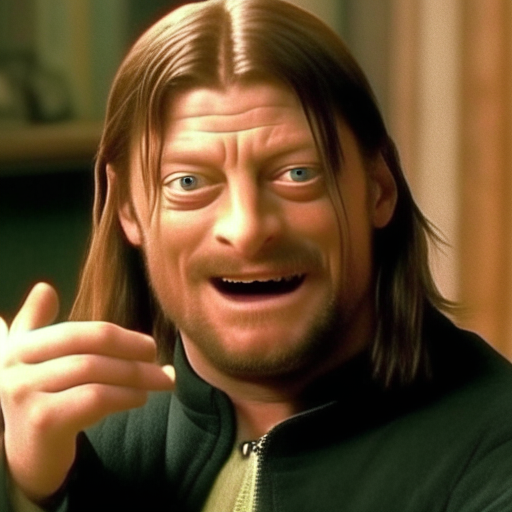
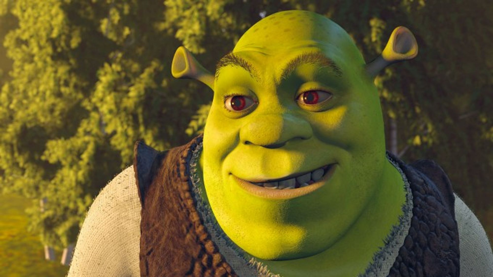
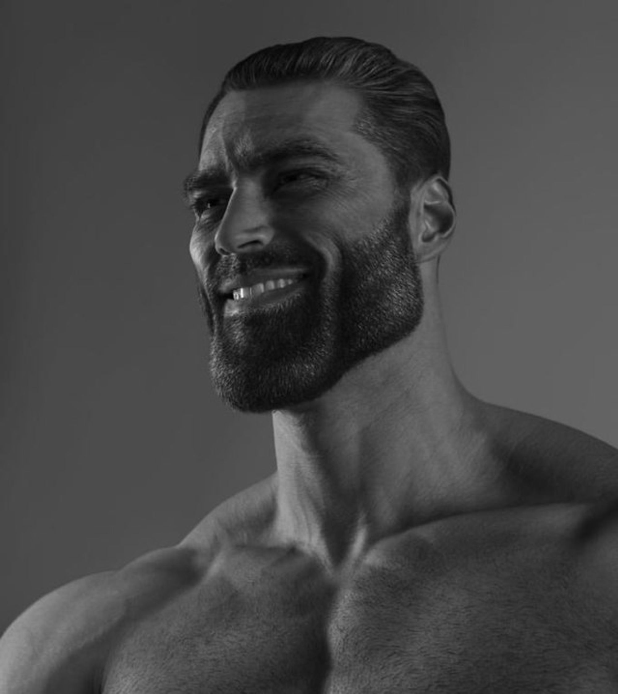
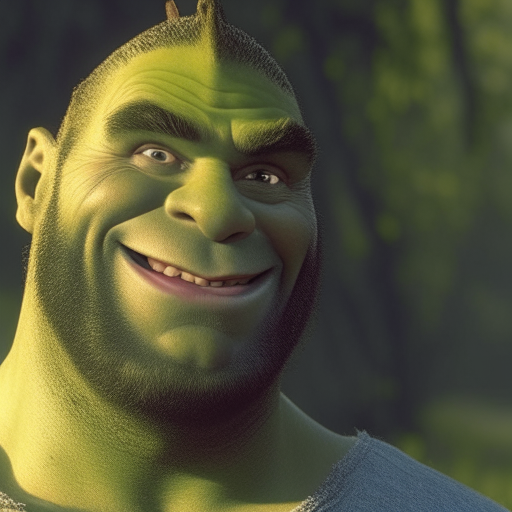

# Тестовое задание

Необходимо было смешать два изображения, чтобы придать первому изображению черты второго. Для этого мы воспользуемся image fuse и моделью с открытым кодом [Kandinsky 2.2](https://github.com/ai-forever/Kandinsky-2).

## Метод решения

Будем объединять два изображения с помощью `mix_images`, но учитывая, что нам надо отдать предпочтения первой картинке из двух, то веса смешивания будут не равными, а зафиксированными эмпирически 0.7 и 0.3 соответственно у первой и второй картинки.

## Как запустить

Для запуска смешивания есть файл `run.py`, который запускается следующим образом:
```bash
python run.py [--device cpu] [--flash_attention true] [--model_version 2.2] img1.jpg img2.jpg
```
Выходное изображение будет записано в файл `mix.png`.

## Примеры работы программы

Ниже приведены примеры работы программы:

1. Исходные изображения:

| Левое | Правое |
| -- | --- |
|  |  |

Результат:



2. Исходные изображения:

| Левое | Правое |
| -- | --- |
|  |  |

Результат:


